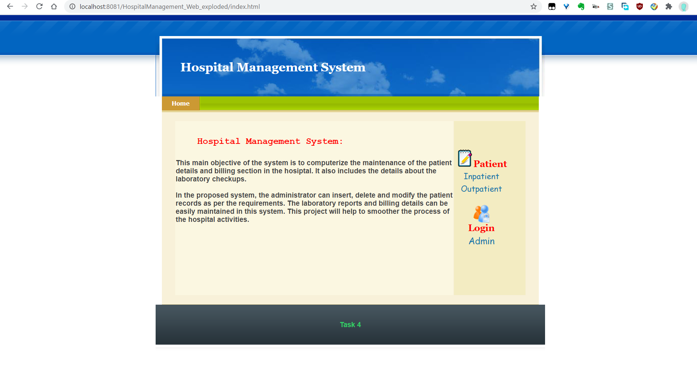
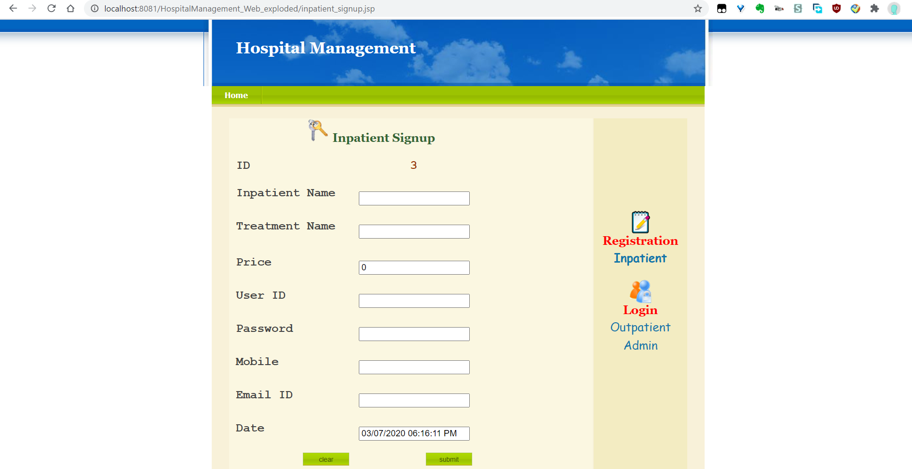
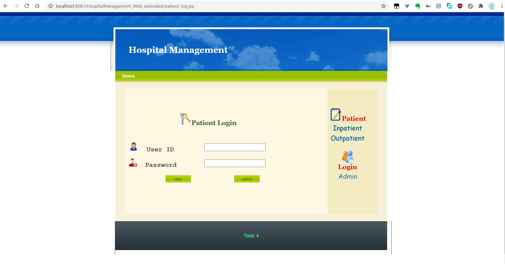
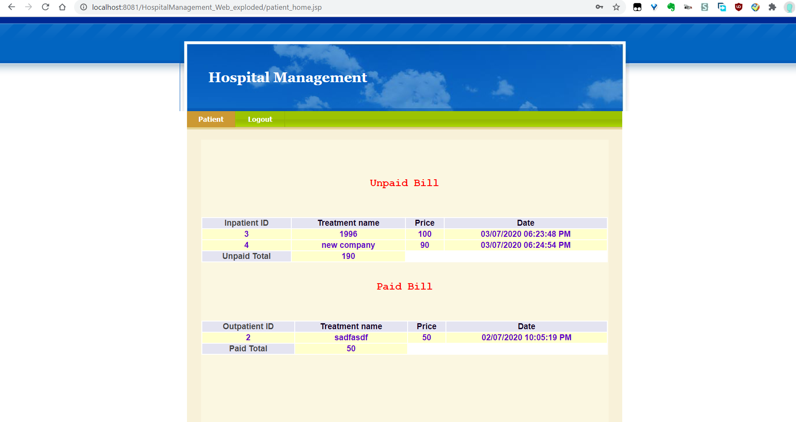
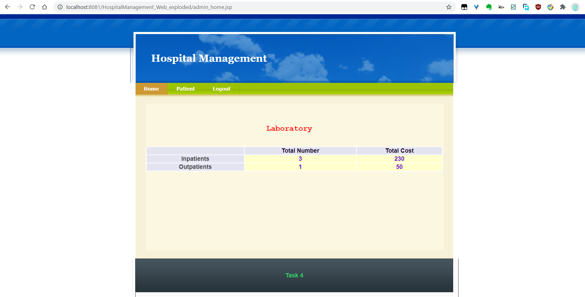
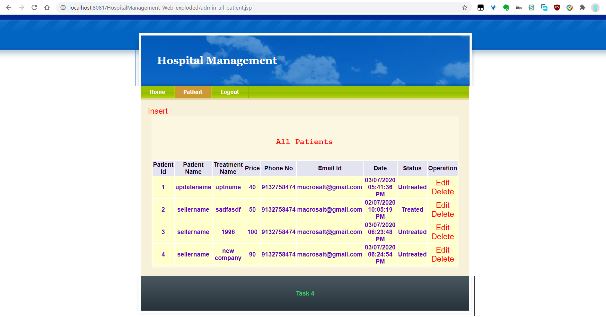
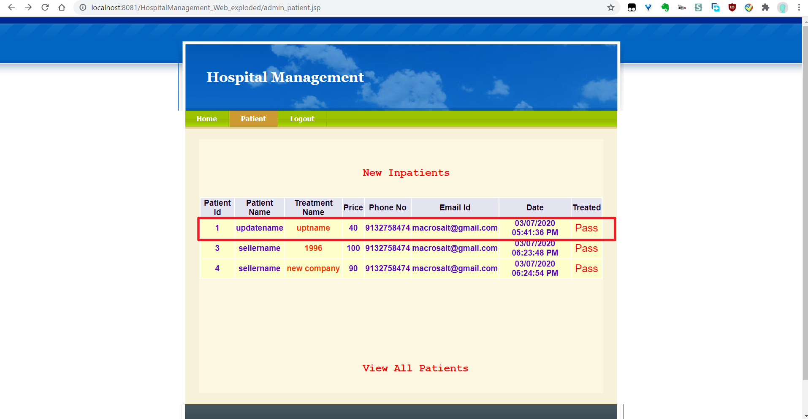
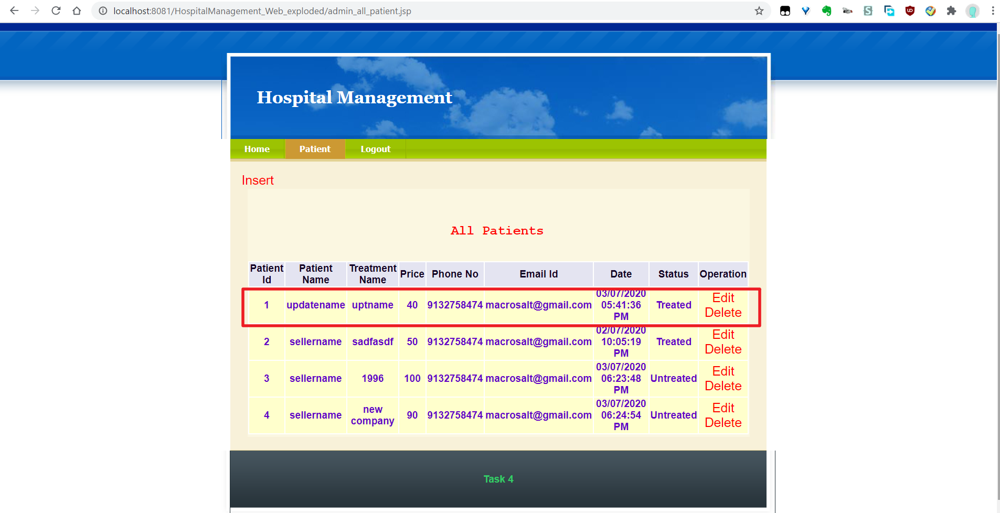
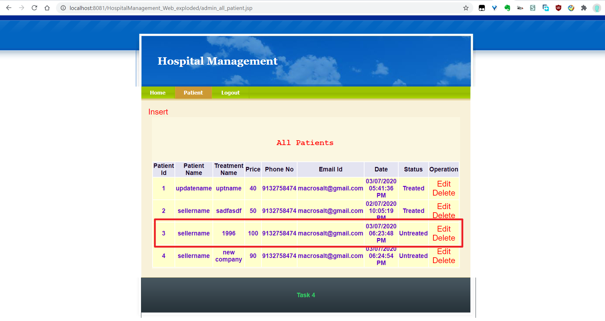
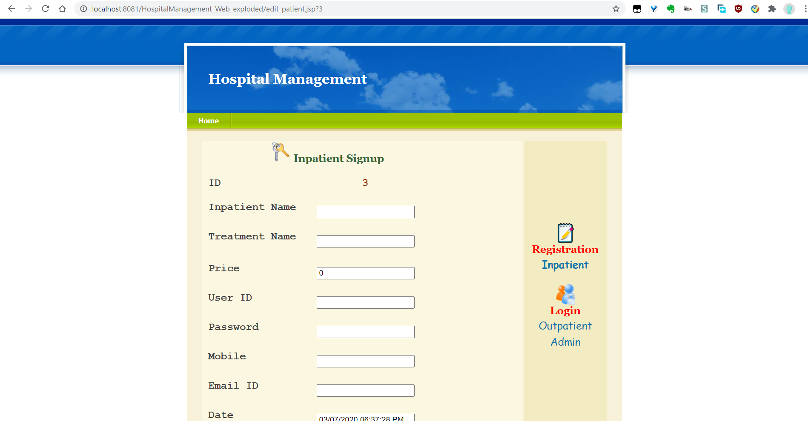

# Usercase
The project has two roles: `admin` and `patient`. Patients have two stages: `inpatient` and `outpatient`. Inpatient becomes outpatient when he is passed by admin, which means he has received and paid for the treatment.

`Patient` need to signup for each treatment. Any account he has created can access his treatment history, which is identified by his name and mobile phone. All his paid (as `outpatient`) and unpaid (as `inpatient`) `bill`s can be viewed.

`Admin` can check the current circumstance of the `labortary`. Also he has total control of the records. He can insert, edit, delete and view all the records of patients.

The use of the system is instructed by following screenshots.
# Screenshots

- Index page

- Inpatient signup / Admin insert / Admin edit

  

- Login

- Patient bill

- Lab overview

- View all patients records

  

- Pass inpatient to outpatient

- Edit patient record

